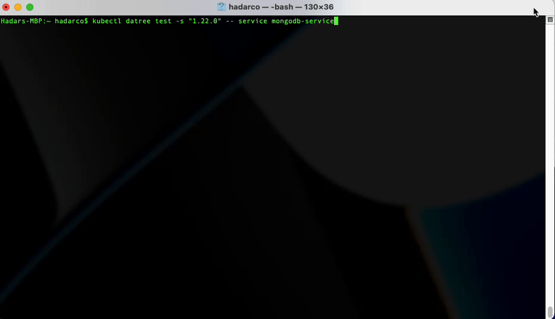

# kubectl-datree
   

## Overview 
[Datree's CLI](https://github.com/datreeio/datree) provides a policy enforcement solution to run automatic checks for rule violations in Kuberenetes configuration files.  
This **kubectl plugin** extends the Datree CLI's capabilities to allow scanning resources within your cluster for misconfigurations.  

<p align="center">
   
</p>

👉 **Docs:** [https://hub.datree.io/kubectl-plugin](https://hub.datree.io/kubectl-plugin/#utm_source=github&utm_medium=organic_oss)

<br/>

## Supported Platforms
This plugin supports **MacOS** and **Linux**.
<br/><br/>

## Installation
### Via Krew
1. Install [krew](https://krew.sigs.k8s.io/docs/user-guide/setup/install/)
2. Install the datree plugin:
```
kubectl krew install datree
```
### Manual installation
1. [Download the installation script](https://github.com/datreeio/kubectl-datree/releases/latest/download/manual_install.sh) from this repository.
2. Open a terminal at the location of the script. 
3. Run ```/bin/sh manual_install.sh``` (an administrator password will be required to complete the installation).  

<br/>

## Usage
```
kubectl datree test [datree CLI args] -- [options]
```
**Arguments:**
```
datree CLI args:
  This plugin supports all of the Datree CLI arguments: https://hub.datree.io/cli-arguments

options:
  [-n <namespace>] Test all resources in the cluster belonging to the specified namespace
  [<resource type> <resource name> <namespace>] Test a single given resource in the cluster

  Running 'kubectl datree test' with no arguments is equivalent to 'kubectl datree test -- -n default'
```

<br/>

## Specification
The plugin supports the following resource types:
* Pod
* Service
* Ingress
* Daemonset
* Deployment
* Replicaset
* Statefulset
* Job
* CronJob  

:warning: When running against a given namespace, only resources of these types will be checked.  

<br/>

## Examples
This command will fetch all resources within the namespace `exmpl`, and execute a policy check against them:
```
kubectl datree test -- -n exmpl
```

This command will fetch the resource of kind `Service` named `myAwesomeService` in namespace `myCoolNamespace`, and execute a policy check against it using k8s schema version 1.22.0:
```
kubectl datree test -s "1.22.0" -- service myAwesomeService myCoolNamespace
```

